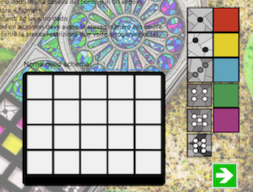

**Group 19 [10525479 BAGARIN STEFANO - 10490724 BANFI STEFANO ALESSANDRO - 10527150 BRESCIANI MATTEO]**

From a **Cranio Game:registered:**: 

For more information about original boarder game visit http://www.craniocreations.it/prodotto/sagrada/
Or read [Game's Rule (ITA)](/Rules.pdf)

//todo instruction to open jar file

## Function implemeted on project
### Networking:
- [x] **RMI**;
- [x] **Socket**;

### View Interface:
- [x] Graphic User Interface; (**GUI**)
- [x] Command Line Interface; (**CLI**)

### Advanced functionality: 
- [x] **Dynamic Schema Card**: application builds schema (where client plays) run-time. It was added also a Schema Editor, in which every player can, before playing, built his own schema with a simple drag and drop action. 

- [x] **Multiple Games**: Server can gesture more than one game at the same moment. So if you're more than 4 players don't worry! You can play anyway in 2 or more different match concurrently.

### Other functionality:

- use of Lamda Expression of Java 8 (Functional)

